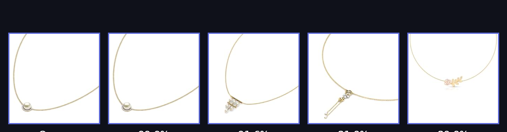
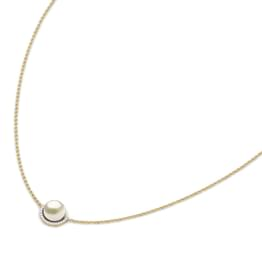
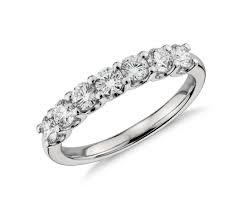

<div align="center">

# 💍 Jewelry Search

**Production-grade Visual Search Engine for Jewelry**

Upload a photo — find visually similar pieces from the catalog in milliseconds.

[](https://www.python.org/)
[](https://onnxruntime.ai/)
[](https://streamlit.io/)
[](https://www.trychroma.com/)

</div>

---

## ✨ What is this?

An end-to-end **visual similarity search engine** built on the [Tanishq Jewellery Dataset](https://www.kaggle.com/datasets/mariajessica/tanishq-jewellery-dataset).
Images are converted into high-dimensional embeddings with **MobileNetV2** (transfer learning, classification head removed) and stored in a **ChromaDB** vector database. When a user uploads or captures a photo, the app finds the nearest visual neighbors using **cosine similarity** — no text, no tags, just pixels. 🔮

### Example: query → top matches

Upload a necklace photo and instantly get the 25 most visually similar pieces, ranked by similarity:

<div align="center">

</div>

<br>

<table align="center">
  <tr>
    <td align="center"><b>📷 Query image</b></td>
    <td align="center"><b>📷 Query image</b></td>
  </tr>
  <tr>
    <td></td>
    <td></td>
  </tr>
</table>

---

## 🏗️ How it works

```
                ┌──────────────────────────────────────────────┐
   Offline      │  prepare_data.py                             │
   pipeline     │  images → MobileNetV2 → 1280-d embeddings    │
                │             → ChromaDB (data/chroma)         │
                └───────────────────┬──────────────────────────┘
                                    │
   Online       ┌───────────────────▼──────────────────────────┐
   app          │  app.py                                      │
                │  upload/camera → preprocess → embedding      │
                │  → top-25 nearest neighbors → cosine sim %   │
                └──────────────────────────────────────────────┘
```

1. **Offline** — every catalog image passes through `MobileNetV2(include_top=False)` + `GlobalAveragePooling2D`, producing a 1280-dimensional embedding that is saved to ChromaDB.
2. **Online** — the query photo is resized to 224×224, normalized, embedded with the exported **ONNX** model (identical weights, tiny runtime), and compared against the index.
3. Results are sorted by cosine similarity, filtered by a user-adjustable threshold (so a photo of a phone returns *"no similar items"* instead of junk). 🚫📱

---

## 🚀 Getting started

```bash
# 1. Clone the repo
git clone https://github.com/<your-username>/jewelry_search.git
cd jewelry_search

# 2. Create a virtual environment & install dependencies
python -m venv venv
source venv/bin/activate        # Windows: venv\Scripts\activate
pip install -r requirements.txt

# 3. (Optional) Rebuild the vector index
python prepare_data.py

# 4. Launch the app 🎈
streamlit run app.py
```

Then open http://localhost:8501 — upload an image from your disk 📁 or take a photo with your webcam 📸 and hit search.

---

## ☁️ Deploy on Streamlit Community Cloud

1. Push the repo to GitHub.
2. Go to [share.streamlit.io](https://share.streamlit.io) → **New app** → pick this repo and `app.py`.
3. Click **Deploy** 🚀 — inference runs on ONNX Runtime, so the default Python version works out of the box (no TensorFlow install needed on the cloud).

---

## 📁 Project structure

```
/jewelry_search
├── data/
│   ├── Jewellery_Data/      # Tanishq dataset (necklaces, rings)
│   └── chroma/              # ChromaDB vector index (pre-computed embeddings)
├── examples/                # Sample images used in this README
├── model/                   # Exported ONNX embedding model (inference)
├── prepare_data.py          # Offline pipeline: images → embeddings → ChromaDB
├── app.py                   # Streamlit web application
├── embedding.ipynb          # Exploration & prototyping notebook
└── requirements.txt         # Dependencies
```

---

## 🧰 Technologies

| Icon | Technology | Role |
|------|------------|------|
| 🤖 | **MobileNetV2** | Transfer-learning backbone (TensorFlow, offline) — 1280-d visual embeddings |
| ⚡ | **ONNX Runtime** | Lightning-fast inference of the exported embedding model (no TF on the server) |
| 🧬 | **ChromaDB** | Persistent vector database — fast nearest-neighbor retrieval |
| 🎈 | **Streamlit** | Interactive web UI with `@st.cache_resource` for snappy loads |
| 🧮 | **scikit-learn** | Cosine similarity ranking of retrieved vectors |
| 🖼️ | **Pillow / NumPy** | Image preprocessing (resize, normalize, array ops) |
| 🐍 | **Python** | Glue that makes it all work |

---

## 🔍 Discussion questions

- **The Semantic Gap:** if a user queries a *silver* ring but the system returns a *gold* ring with the same diamond setting — is that "relevant"? Embeddings capture shape & texture, not material semantics.
- **Improving precision:** swap MobileNetV2 for a stronger backbone (e.g. ViT), or fine-tune with **triplet loss** to pull same-class pairs closer and push hard negatives apart.

---

<div align="center">

Made with 💍 and 🎈 by Adnan

</div>
